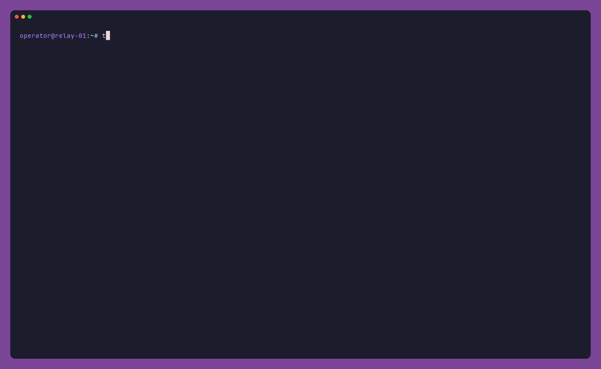
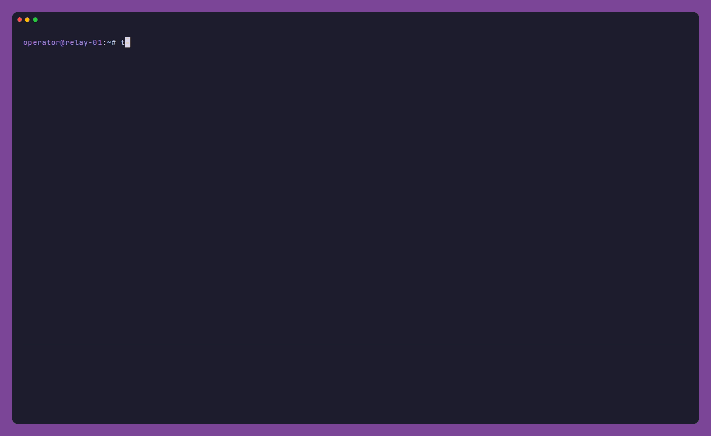

# Tor Relay Setup

[](https://github.com/ljkx/tor-relay-setup/actions/workflows/ci.yml)
[](https://github.com/ljkx/tor-relay-setup/actions/workflows/codeql.yml)
[](https://scorecard.dev/viewer/?uri=github.com/ljkx/tor-relay-setup)
[](https://github.com/ljkx/tor-relay-setup/releases)
[](go.mod)
[](LICENSE)

Set up and run a public **Tor relay** on Debian or Ubuntu from one small, signed binary. `tor-relay-setup` combines a guided setup wizard, a declarative `apply` mode for repeatable servers, and an operator console for everything after day one. Every change is shown before it happens.

<p align="center">
  
</p>

## What it does

- **Installs tor ≥ 0.4.9 from the Tor Project repository.**
  - The signing key is checked in Go against its pinned fingerprint and must be the only key in the file.
  - The `tor` package must come from `deb.torproject.org`.
  - Everything installs in a single apt transaction, with a real progress bar.
- **Relay families with FamilyId keys** (Tor 0.4.9 "Happy Families"): create a key on your first relay, then import it on the rest.
- **A ContactInfo that follows the CIISS v3 spec**, built for you.
- **Monthly quota pacing**, so a 10 TB VPS plan becomes a steady rate and the relay never hibernates halfway through the month.
- **The rest of the setup:** firewall rules (SSH is always allowed first), a local Unbound resolver for exit DNS, unattended upgrades, Nyx, and an optional local-only MetricsPort.
- **Verification before and after:** every torrc is checked by `tor --verify-config` before it replaces the live file. After Tor starts, the tool checks the service, the listener, family-key warnings, and Tor's own reachability self-test, which it keeps waiting for in the background.
- **A dashboard for existing relays:** run it again on a configured relay and you get health, live traffic from the MetricsPort, a month of Tor Metrics history, a live log, family management, settings, updates, and key backups. It refreshes itself.
- **Bridges for censored users:** obfs4 bridges and WebTunnel bridges (hidden behind an ordinary HTTPS site, with nginx and an optional certbot certificate), with a shareable bridge line.
- **Exit tools:** an exit policy editor (Tor's reduced policy, web-only, default, or your own rules), an exit notice page served by tor, and abuse-reply templates.
- **Identity keys and ContactInfo proofs:** move a relay's master key offline and renew its signing key, and generate the files that prove your relays' ContactInfo.
- **Several relays per server:** add relays as Debian tor instances, with ports, MetricsPorts and the shared family key handled for you.
- **Fleets:** describe all your relays in one `fleet.toml`. Apply it over SSH in parallel as one family, watch every relay in one dashboard with aggregate statistics, and roll out restarts or Tor updates one relay at a time.
- **Monitoring and alerts:** overload warnings before Relay Search flags you, notifications through ntfy, webhooks, email or a command, and Prometheus output.
- **A Grafana for the whole fleet:** `monitor install` sets up HTTPS Grafana dashboards of every relay, aggregated, on a management server. Relays are probed over SSH with a key that can run only a read-only probe.

## Install

The recommended way is the verified installer. It checks the release against `SHA256SUMS`, and verifies the Sigstore build provenance too if the GitHub CLI is installed:

```bash
curl -fsSLO https://raw.githubusercontent.com/ljkx/tor-relay-setup/main/install.sh
less install.sh
sudo bash install.sh
```

<details>
<summary>Other ways: .deb package, manual download, from source</summary>

**Debian package** (`amd64` or `arm64`):

```bash
VERSION=v3.3.0
ARCH=$(dpkg --print-architecture)
curl -fsSLO "https://github.com/ljkx/tor-relay-setup/releases/download/${VERSION}/tor-relay-setup_${VERSION#v}_${ARCH}.deb"
gh attestation verify "tor-relay-setup_${VERSION#v}_${ARCH}.deb" -R ljkx/tor-relay-setup   # optional
sudo apt install "./tor-relay-setup_${VERSION#v}_${ARCH}.deb"
```

**Manual:** download `tor-relay-setup_<version>_linux_<arch>.tar.gz` and `SHA256SUMS` from the [releases page](https://github.com/ljkx/tor-relay-setup/releases). Then run `sha256sum --ignore-missing -c SHA256SUMS`, extract the archive, and put the binary on your `PATH`.

**From source** (Go 1.27+):

```bash
go install github.com/ljkx/tor-relay-setup/cmd/tor-relay-setup@latest
```

</details>

**Updating:** `sudo tor-relay-setup self-update` installs the newest release after the same checksum and provenance checks (`--check` only reports). The console's header shows when a newer release exists. A `.deb` install is updated with apt instead.

## Use

```bash
tor-relay-setup --dry-run      # the full experience; nothing on the server changes, no root needed
sudo tor-relay-setup           # setup wizard on a fresh server, operator console on an existing relay
```

On a fresh server you answer seven short steps:
1. relay type
2. contact
3. network
4. family
5. bandwidth
6. system
7. review

A live `torrc` preview and a panel of facts about the server (release, memory, repository availability, IPv6 reachability, firewall, SSH ports) sit beside the questions. Those facts are gathered in the background the moment the tool starts. Nothing is modified until you press `a` on the review screen and confirm.

> [!IMPORTANT]
> This is privileged server software. Run `--dry-run` first and read the review screen before you apply.

### Repeatable setups and fleets

Press `s` on the review screen to save your answers as `relay.toml`, or start from [`docs/examples/relay.toml`](docs/examples/relay.toml). Then apply the file on any number of servers:

```bash
sudo tor-relay-setup apply --config relay.toml          # shows the plan, asks once
sudo tor-relay-setup apply --config relay.toml --yes    # unattended, plain output
```

### Bridges

Choose **Bridge** as the relay type to help people in censored countries reach Tor. Bridges are not listed in the public consensus. Users get their address, the **bridge line**, from Tor's distributors or from you.

- **obfs4:** the classic obfuscated transport. It uses `obfs4proxy` (or `lyrebird` where Debian ships it), a separate public port, and optionally a port below 1024 such as 443. See [`bridge-obfs4.toml`](docs/examples/bridge-obfs4.toml).
- **WebTunnel:** the bridge hides behind an ordinary HTTPS website on your domain. The tool installs the Tor Project's `webtunnel` package and nginx, with a secret path proxied to the bridge. The TLS certificate is either one you already have or a new one from certbot, which you confirm explicitly. See [`bridge-webtunnel.toml`](docs/examples/bridge-webtunnel.toml).

The console's **Bridge line** view (`i`) shows the line to share, with the public address filled in, and links to the [reachability scan](https://bridges.torproject.org/scan/) and the bridge's status page. Tor Metrics only ever sees the bridge's hashed fingerprint. Bridges never join a relay family and run without Sandbox, because Tor refuses Sandbox with pluggable transports. The bridge line is shown in the terminal but left out of `status --json`: anyone who has it can use the bridge, and a censor can block it.

### Exit relays

The wizard and the console's **Exit policy** view (`x`) offer four policies:
- Tor's built-in `ReducedExitPolicy`;
- web only (80 and 443);
- Tor's default policy;
- your own `accept`/`reject` rules, validated and checked with `tor --verify-config` before anything is written.

Optionally, tor itself serves an [exit notice page](docs/examples/tor-exit-notice.html) on port 80, explaining to anyone who looks up your IP address that it is a Tor exit. [`docs/examples/`](docs/examples) also has reply templates for copyright notices, other abuse complaints, and law-enforcement requests.

### Identity keys and ContactInfo proofs

- **Offline master key** (`keys`, console `k`): shows when the relay's signing certificate expires, and warns a week ahead if tor can't renew it itself. `keys offline` sets `OfflineMasterKey 1` and exports the master key for you to store elsewhere. Only after you type the start of the copy's SHA-256 does `keys offline --remove-master` delete it from the server. `keys renew` creates the next signing key from the master key, or installs one you made with `tor --keygen` on another machine.
- **ContactInfo proof** (`proof`, console `c`): prints `.well-known/tor-relay/ed25519-family-id.txt` for the [CIISS](https://nusenu.github.io/ContactInfo-Information-Sharing-Specification/) `uri-familyid-ed25519` proof, to publish on the domain in your ContactInfo's `url:`. `proof --check` fetches the published file over HTTPS and confirms that it lists your relays.

### Several relays on one server

Big servers can carry several relays, up to the directory authorities' limit of 8 per IPv4 address. Press `n` in the console to add one, or set `relay.instance = "relay2"` in a config. Each extra relay is a Debian tor instance (`tor@relay2`, `/etc/tor/instances/relay2/torrc`). The tool picks free ports, gives each relay its own MetricsPort (9036 upwards), and installs the server's family key for it. With several relays, the console gets a relay switcher (`[` `]` or `1`–`9`) and an all-relays health line, and `status --all` reports every relay.

For relays above about 100 Mbit/s, the System step offers optional **kernel tuning**: a wider ephemeral port range, a larger connection-tracking table, and an open-file limit check, each with its reason in the written file.

### Fleets

Describe your relays once in a [`fleet.toml`](docs/examples/fleet.toml). It names a base `relay.toml`, a nickname template such as `MyRelay{n}`, and one `[[host]]` per relay; any `relay.toml` table can be overridden per host. Everything is validated locally before the first SSH connection.

```bash
tor-relay-setup apply --inventory fleet.toml --dry-run    # every change on every host
tor-relay-setup apply --inventory fleet.toml --parallel 8 # family host first, then 8 servers at a time
tor-relay-setup fleet                                      # the fleet dashboard
tor-relay-setup fleet restart --yes                        # rolling restart, waiting until each relay is back
```

The tool uses your own `ssh`, so `~/.ssh/config`, keys, jump hosts, and `known_hosts` all apply, and connections are shared per host. The remote user must be root or have passwordless sudo. With `family.mode = "generate"`, the first relay creates the family key and every other relay imports it.

The **fleet dashboard** probes every relay over SSH every 10 seconds and asks Tor Metrics about the whole fleet at once:
- **Totals:** relays running, the fleet's share of the network's consensus weight, combined guard and exit probability, live combined throughput, and a month of combined traffic.
- **A sortable, filterable table** with one row per relay, and a detail view for each.
- **Needs attention:** unreachable hosts, relays out of the consensus, missing or mismatched family keys, Tor version drift, and flags lost since the last look.
- **Rolling actions:** restart, reload, or update Tor on the relays in view, one at a time.

`fleet status --format text|json|prometheus` gives the same data without the dashboard. Each host needs tor-relay-setup installed (`install.sh`) for the dashboard and rolling actions.

### Monitoring and alerts

```bash
tor-relay-setup status                       # human summary, exit code 1 when something needs attention
tor-relay-setup status --json                # the same report as JSON, for scripts
tor-relay-setup status --format prometheus   # tor_relay_setup_* gauges for node_exporter's textfile collector
sudo tor-relay-setup alert install           # check every 5 minutes and notify on changes
```

`alert` notifies through ntfy, webhooks (including Slack-compatible ones), email via `sendmail`, or any command. It reports when the service stops, the ORPort becomes unreachable, a family key goes missing, the relay drops out of the consensus or loses a flag, Tor's overload signals fire, the accounting budget will run out early, a signing certificate is about to expire, or a bridge transport stops. It notifies when a problem appears, reminds you daily while it lasts, and tells you when it is resolved. Configure it in `/etc/tor-relay-setup/alerts.toml` ([example](docs/monitoring/alerts.toml)), and try it with `alert test`.

[`docs/monitoring/`](docs/monitoring/README.md) has the textfile-collector timer, safe ways to scrape Tor's MetricsPort, Prometheus alerting rules, and a [Grafana dashboard](docs/monitoring/grafana-dashboard.json).

### Grafana for the whole fleet

On a small management server (not a relay), one command sets up an HTTPS Grafana with every relay's statistics, aggregated:

```bash
sudo tor-relay-setup monitor install --domain grafana.example.org --email you@example.org
```

It installs and configures four pieces:
- **fleet serve:** probes your relays over SSH.
- **Prometheus:** keeps 400 days of history.
- **Grafana:** from Grafana's signed apt repository, with the dashboards provisioned.
- **Caddy:** gives Grafana a Let's Encrypt certificate.

Only ports 80 and 443 are opened. Grafana and Prometheus listen on localhost, and the admin password is generated and shown once.

On each relay, allow the monitoring server's key; `monitor status` prints the exact command:

```bash
sudo tor-relay-setup fleet authorize --key 'ssh-ed25519 AAAA… tor-relay-monitor@monitor' --from 203.0.113.10
```

That key can only run the read-only `fleet-probe`, as a dedicated `tor-relay-probe` user with exactly one sudo rule (a forced command). Relays expose nothing new.

The dashboards:
- **Tor fleet — overview:**
  - relays and hosts up;
  - the fleet's share of the network, and its guard, middle and exit probability;
  - live and 30-day traffic, with throughput per relay;
  - a relay table;
  - a world map and diversity by country, AS, role and version;
  - overload signals, accounting budgets, family and signing-key status;
  - probe health, and firing alerts from the bundled Prometheus rules.
- **Tor fleet — relay detail:** the same for one relay over time.

`https://grafana.example.org/fleet/` also serves fleet serve's own read-only web view, behind its own login. See [`docs/monitoring/README.md`](docs/monitoring/README.md#fleet-dashboard-on-a-management-server) for the architecture and security design. `tor-relay-setup fleet serve --demo` serves a synthetic fleet if you want to look first.

## The operator console

<p align="center">
  
</p>

The dashboard keeps itself current:
- **Live traffic** is read from the MetricsPort every 2 seconds: rates in each direction, a two-minute sparkline, and open connections.
- **Health** is re-checked every 30 seconds.
- **Tor Metrics** is fetched every 30 minutes, including a sparkline of the last month's traffic with totals in and out.

| Key | Action | What it does |
| --- | --- | --- |
| `r` | Refresh | Re-checks everything now, including Tor Metrics; the footer shows when the data was last updated |
| `l` | Live logs | Follows the Tor journal in place, with self-test and warning lines highlighted |
| `i` | Bridge line | Bridges only: the line to share, a copy key, reachability and status links |
| `f` | Relay family | FamilyId status, create or rotate a key, import, share instructions, remove, legacy MyFamily cleanup |
| `x` | Exit policy | Exits only: reduced, web, default, or custom rules; IPv6 exit; the exit notice page |
| `e` | Edit settings | Nickname, ContactInfo, bandwidth, MetricsPort, Sandbox. Verified by tor before anything is written. |
| `k` | Identity keys | Signing certificate expiry, moving the master key offline, renewing the signing key |
| `c` | ContactInfo proof | The proof file to publish on your website, and a check of the published copy |
| `s` / `o` | Restart / Reload Tor | Restarts and verifies the service, or reloads after checking the torrc |
| `p` | Stop / start Tor | Takes the relay offline (with confirmation) or brings it back |
| `u` | Update Tor | Refreshes apt and upgrades tor from the Tor Project repository, with progress |
| `b` | Back up keys | Writes a root-only archive of the identity and family keys |
| `w` | Reconfigure | Reopens the full wizard, pre-filled from the current torrc, keeping its family |
| `n` | Add a relay | Sets up another relay on this server as a tor instance, with free ports and the server's family key |
| `[` / `]`, `1`–`9` | Switch relay | With several relays on the server, selects the relay every card and action works on |

## Requirements

| | |
| --- | --- |
| **OS** | Debian 12 `bookworm`, Debian 13 `trixie`, Ubuntu 22.04 `jammy`, Ubuntu 24.04 `noble`, Ubuntu 26.04 `resolute` (all tested in CI). Other codenames work once the [Tor apt repository](https://deb.torproject.org/torproject.org/dists/) publishes them. |
| **CPU** | `amd64` or `arm64`, the architectures the Tor repository builds |
| **Init** | systemd (`tor@default.service`, and `tor@NAME.service` for extra relays) |
| **Network** | A public, static IPv4 address; IPv6 is optional. Inbound TCP to the ORPort must be open, including in your provider's cloud firewall. |
| **Relay capacity** | At least 10 Mbit/s each way (16 Mbit/s or more recommended), and at least 100 GB/month in each direction. Memory: 512 MiB, 1 GiB above 40 Mbit/s, 1.5 GiB for exits. See the [Tor relay requirements](https://community.torproject.org/relay/relays-requirements/). |

## Why it's fast

Version 3 replaced the Bash script with a Go binary. The script's own logic was never the bottleneck; the waiting around it was, and v3 removes it:

| | v2 (Bash) | v3 |
| --- | --- | --- |
| apt | up to 4× `apt-get update`, 7–8 separate installs | **one** update and **one** transaction; waits out apt locks instead of failing |
| Signing key | fetched with wget, checked with gpg | fetched and verified in-process; no gpg or wget needed |
| Server checks | run one by one, in the foreground | run concurrently at start-up (about 55 ms), while you answer questions |
| Between questions | a new fzf process for every prompt | one Bubble Tea program, so there is no delay |
| Command output | a window that waited for Enter after every step | a live checklist, a progress bar, and a log you can open |
| Reachability wait | blocked for up to 90 s | runs in the background with a timer; press Enter to finish now |

A complete dry run, including the real repository and key checks over the network, finishes in well under a second.

## Relay families

If you run more than one relay, clients must know that they share an operator. Tor 0.4.9 replaced fingerprint lists (`MyFamily`) with a shared **family key**:

1. On your first relay, choose **Create a new family key**. The tool runs `tor --keygen-family`, installs the key for `debian-tor` with mode `0600`, and adds `FamilyId <id>` to the torrc.
2. Copy the key to your other relays. **Console → Relay family → Share** prints the exact `scp` commands.
3. On each other relay, choose **Import an existing family key**.

`tor --verify-config` does not notice a missing key file, so the tool checks for one itself, and it reports any family warnings Tor logs after a restart. Details: [Tor's family ID guide](https://community.torproject.org/relay/setup/post-install/family-ids/) and the [operator guide](docs/OPERATOR_GUIDE.md#relay-families).

## What it changes

Nothing changes before you confirm the review screen. Every replaced file is first backed up as `<file>.bak.<UTC timestamp>`.

| Path / component | When |
| --- | --- |
| `/etc/apt/sources.list.d/tor.sources`, `/usr/share/keyrings/deb.torproject.org-keyring.gpg` | always |
| packages `tor`, `deb.torproject.org-keyring` (+ `nyx`, `unbound`, `ufw`, `unattended-upgrades`, `apt-listchanges` as chosen) | one apt transaction |
| `/etc/tor/torrc`, or `/etc/tor/instances/NAME/torrc` for an extra relay | always, after `tor --verify-config` accepts the new version |
| a tor instance (`tor-instance-create NAME`: user `_tor-NAME`, `/var/lib/tor-instances/NAME`, `tor@NAME`) | extra relays on one server |
| `<key directory>/<name>.secret_family_key` | creating or importing a family; existing keys are never overwritten |
| `/etc/apt/apt.conf.d/52tor-relay-unattended-upgrades`, `20auto-upgrades` | automatic updates |
| firewall rules | when chosen; SSH ports are allowed before UFW is enabled |
| `/etc/resolv.conf` | exits using Unbound; rolled back automatically if DNS stops resolving |
| `/etc/hostname`, `/etc/hosts` | only if you rename the host |
| `/etc/sysctl.d/60-tor-relay.conf`, a conntrack udev rule, a `LimitNOFILE` drop-in | only with `system.tuning` |
| `obfs4proxy`/`lyrebird` or `webtunnel`, nginx site `tor-webtunnel-<instance>`, certbot certificate | bridges, as chosen; nginx changes pass `nginx -t` first |
| `setcap` on the transport, a `NoNewPrivileges=no` drop-in, a managed block in `/etc/apparmor.d/local/system_tor` | an obfs4 port below 1024, or WebTunnel |
| `tor-exit-notice.html` next to the torrc | exits with the exit notice page; an existing page is kept |
| `/etc/systemd/system/tor-relay-setup-alert.{service,timer}`, `/etc/tor-relay-setup/alerts.toml` (yours) | `alert install` |
| `/var/lib/tor-relay-setup/state.json`, `/var/log/tor-relay-setup/*.log` | the tool's own state, and a log of each apply |

There is no telemetry. The tool only contacts:
- apt mirrors and `deb.torproject.org`;
- `onionoo.torproject.org`, for directory status and traffic history;
- the IPv6 directory authorities, for the optional IPv6 check;
- `api.github.com`, at most once a day from the console to see whether a newer release exists (`TOR_RELAY_SETUP_NO_UPDATE_CHECK=1` turns that off), and when you run `self-update`.

## Command reference

```text
tor-relay-setup [flags]                   console on a configured relay, otherwise the setup wizard
tor-relay-setup setup [flags]             run the setup wizard
tor-relay-setup apply --config FILE       apply a saved relay.toml (--yes skips the confirmation)
tor-relay-setup apply --inventory FILE [--parallel N] [--only LIST] [--keep-going]
                                          apply a fleet inventory over ssh, family host first
tor-relay-setup console                   open the operator console
tor-relay-setup status [--all] [--format text|json|prometheus]
                                          relay health; text and json exit 1 when something needs attention
tor-relay-setup fleet [status|restart|reload|update-tor]
                                          fleet dashboard, fleet status, rolling actions
tor-relay-setup fleet serve [--demo]      read-only fleet service: /metrics for Prometheus, JSON API, web view
tor-relay-setup fleet authorize --key KEY on a relay: allow a monitoring server's read-only probe key
tor-relay-setup monitor install --domain NAME
                                          Prometheus + Grafana dashboards behind HTTPS on a management server
tor-relay-setup tor restart|reload|update restart and verify, reload, or upgrade tor on this server
tor-relay-setup alert run|test|install|uninstall
                                          notifications about problems; install adds a systemd timer
tor-relay-setup proof [--all] [--check]   ContactInfo proof files for your website
tor-relay-setup keys status|offline|renew signing key expiry, offline master key, renewal
tor-relay-setup self-update [--check]     install the newest verified release; --check exits 10 if one exists
tor-relay-setup uninstall [--yes]         remove this tool's state, logs, alert timer and binary (never Tor or its keys)
tor-relay-setup version

--dry-run        show every command and file change without making it (no root needed)
--plain          line-by-line prompts and output; also used automatically without a terminal
                 (screen-reader friendly)
--instance NAME  work on one tor instance of this server ("default" is /etc/tor/torrc)
```

`NO_COLOR=1` disables colour. The interface adapts to light and dark terminals. `tor-relay-setup --help` lists every flag and exit code.

## Upgrading from 2.x

Version 3 replaces `setup-tor-guard-relay.sh`, and nothing needs migrating. Install the binary and run `sudo tor-relay-setup`. It reads your existing `/etc/tor/torrc` and opens the console. **Reconfigure** starts the wizard pre-filled from that torrc; existing `FamilyId`s are kept and bandwidth limits are carried over exactly. `/var/lib/tor-relay-setup` from 2.x can simply stay where it is.

## Security

- The review screen shows every privileged change and the complete torrc before anything is applied.
- **Supply chain:**
  - The Tor signing key is pinned by fingerprint and verified in-process, and the `tor` package must come from `deb.torproject.org`.
  - Release binaries, `.deb` packages, and archives carry `SHA256SUMS`, SBOMs, and [Sigstore-signed build-provenance attestations](https://docs.github.com/actions/security-for-github-actions/using-artifact-attestations).
  - Builds are reproducible (`-trimpath`, fixed timestamps).
  - `main` and release tags are protected by rulesets. Releases need a maintainer's approval, and CodeQL and [OpenSSF Scorecard](https://scorecard.dev/viewer/?uri=github.com/ljkx/tor-relay-setup) run continuously.
- ContactInfo, nickname, fingerprint, and FamilyId are **public**. Identity and family keys are secret: back them up (console → `b`) and share them only with your own relays.

Report vulnerabilities privately; see [SECURITY.md](SECURITY.md).

## Development

```bash
make check         # golangci-lint, ShellCheck, shfmt, race tests, govulncheck
make integration   # real Tor apt setup, keygen and tor --verify-config in a Debian container
make demo          # re-record the GIFs above with VHS
```

CI tests at several levels:
- the container integration test on every supported distribution (plus arm64), also run weekly;
- a real, unattended install on a fresh Ubuntu 24.04 VM, with systemd, the firewall, and the running relay checked through `status --json`;
- screen snapshots of the TUI;
- a nightly canary against Tor's nightly and experimental packages.

See [CONTRIBUTING.md](CONTRIBUTING.md) for the architecture and how the tests are organised, and [docs/RELEASE.md](docs/RELEASE.md) for how releases are cut.

## References

- [Tor relay guide](https://community.torproject.org/relay/), [Debian/Ubuntu guard setup](https://community.torproject.org/relay/setup/guard/debian-ubuntu/), [exit relays](https://community.torproject.org/relay/setup/exit/), [exit DNS](https://community.torproject.org/relay/setup/exit/debian-ubuntu/)
- [Tor apt repository](https://support.torproject.org/little-t-tor/getting-started/installing/), [post-install](https://community.torproject.org/relay/setup/post-install/), [family IDs](https://community.torproject.org/relay/setup/post-install/family-ids/)
- [Relay requirements](https://community.torproject.org/relay/relays-requirements/), [expectations for relay operators](https://community.torproject.org/policies/relays/expectations-for-relay-operators/)
- [Bandwidth limits](https://support.torproject.org/relays/performance/bandwidth-limits/), [MetricsPort / overload](https://support.torproject.org/relays/performance/overloaded/)
- [ContactInfo Information Sharing Specification](https://nusenu.github.io/ContactInfo-Information-Sharing-Specification/), [Relay Search](https://metrics.torproject.org/rs.html), [Onionoo](https://metrics.torproject.org/onionoo.html)

## License

[MIT](LICENSE)
